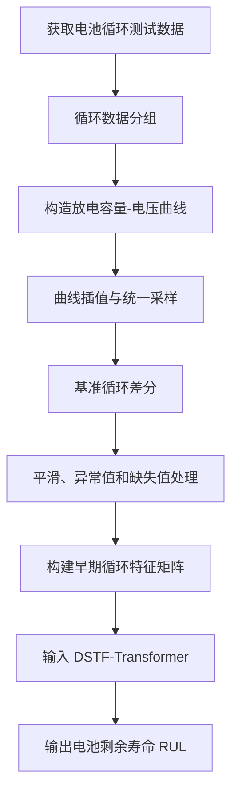
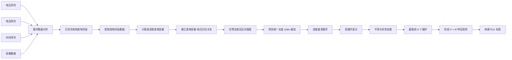
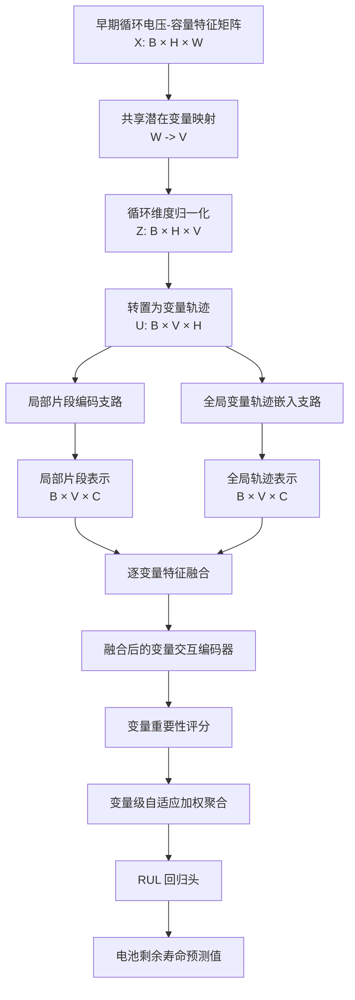
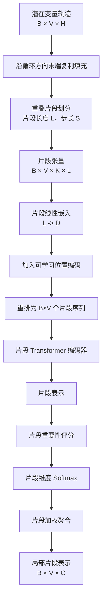
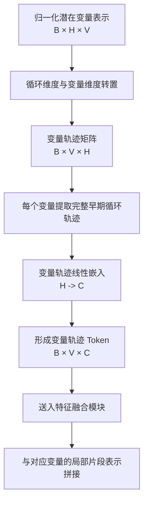
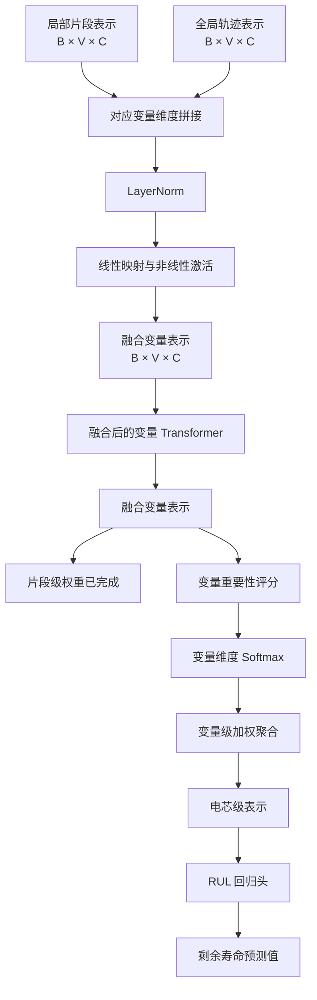

以下按可直接发给公司专利组的“技术交底书初稿”来写。方括号内容为后续需要补充的信息。文中尽量按照当前代码 [patch_itransformer.py](C:/git/BatteryML/batteryml/models/rul_predictors/patch_itransformer.py) 的真实数据流描述。

有一个重要的技术表述需要先说明：当前代码中，轨迹支路先通过 `inverted_embedding` 将每个潜在变量的完整早期循环轨迹映射为变量表示；两条支路融合之后，才通过 `variable_encoder` 进行变量间 Transformer 交互。因此，交底书中建议写成“**全局变量轨迹嵌入支路 + 融合后的变量交互编码模块**”，不要写成“两条支路各自独立经过一个完整 Transformer 后再融合”，这样与实际实现更一致。

# 一、基本信息

## 1. 发明名称

> **一种基于局部循环片段与全局变量轨迹融合的锂离子电池剩余寿命预测方法**

英文名称可对应为：

> **A Remaining Useful Life Prediction Method for Lithium-Ion Batteries Based on Local Cycle Segments and Global Variable Trajectory Fusion**

## 2. 模型名称

中文模型名称：

> **双路径片段与轨迹融合变换器**

英文模型名称：

> **Dual-Path Segment-Trajectory Fusion Transformer**

模型简称：

> **DSTF-Transformer**

## 3. 申请类型

建议申请发明专利，并围绕以下保护对象进行布局：

1. 电池剩余寿命预测方法；
2. 电池剩余寿命预测系统；
3. 执行该方法的电子设备；
4. 存储有相关程序的计算机可读存储介质；
5. 该方法在电池管理系统或电池健康监测系统中的应用。

正式专利名称可以保留“预测方法”，在权利要求中再扩展系统、设备和存储介质。

## 4. 申请人和发明人信息

- 申请人：[公司名称]
- 第一发明人：[姓名]
- 其他发明人：[姓名]
- 所属部门：[部门名称]
- 技术联系人：[姓名]
- 联系方式：[邮箱、电话]
- 预计申请日期：[日期]
- 优先权日期：[日期，如适用]

## 5. 技术成熟度

建议填写：

- 已完成模型代码实现；
- 已完成 BatteryML 框架下的模型注册和训练接口适配；
- 已完成 MATR 数据集上的初步训练或测试；
- 已完成 CALCE 数据集或其他数据集上的适配；
- 当前是否已经形成论文、报告、答辩材料或公开代码：[待确认]；
- 是否已经对外公开：[待确认]。

## 6. 技术来源与知识产权说明

本发明涉及时间序列片段建模、变量轨迹建模和 Transformer 编码等公开技术思想。PatchTST、iTransformer 等公开方法可以作为背景技术或对比方法进行说明，但本发明的技术方案应当重点限定于：

- 面向电池早期循环电压-容量特征的数据构造方法；
- 共享潜在变量映射；
- 局部循环片段编码；
- 全局变量轨迹嵌入；
- 对应变量维度的中间特征融合；
- 融合后的变量交互建模；
- 片段级和变量级自适应加权。

正式申请前，应由公司专利组确认：

- 第三方开源代码的许可条件；
- 当前代码中哪些部分属于已有开源实现；
- 哪些模块是本发明新增或改进的技术内容；
- 发明人和公司之间的职务发明关系；
- 是否存在论文、代码仓库、项目汇报或公开答辩导致的公开风险。

## 7. 技术方案摘要

本发明针对锂离子电池早期循环数据中的退化模式具有局部性、长期性和变量相关性的特点，提出一种 DSTF-Transformer 模型。该模型首先将早期循环电压-容量特征转换为统一维度的潜在变量轨迹，然后通过局部片段编码支路提取局部退化模式，通过全局变量轨迹嵌入支路提取完整早期循环窗口内的变量变化表示，随后在对应潜在变量维度进行特征融合，并通过融合后的变量交互编码和自适应加权聚合输出电池剩余寿命预测值。

# 二、技术领域

本发明属于锂离子电池状态监测与寿命预测技术领域，具体涉及一种基于电池早期循环电压-容量特征、局部循环片段编码、全局变量轨迹嵌入和双路径特征融合的锂离子电池剩余寿命预测方法。

本发明还涉及：

- 电池健康状态估计；
- 电池剩余使用寿命预测；
- 电池管理系统；
- 储能系统运行维护；
- 电动汽车动力电池监测；
- 深度学习和时间序列信号处理。

# 三、背景技术

## 1. 电池剩余寿命预测背景

锂离子电池在反复充放电过程中会发生容量衰减和内阻增长。其退化过程受到固体电解质界面膜增长、活性锂损失、活性材料损失、锂析出以及温度和倍率等因素影响。随着循环次数增加，电池的可用容量逐渐下降。当电池容量下降到预设寿命终止阈值时，通常认为电池达到寿命终止状态。

电池剩余寿命，即 Remaining Useful Life，简称 RUL，通常表示从当前观测时刻到电池达到寿命终止状态之间的剩余循环数。准确预测 RUL 能够为电池更换、维护、充放电策略调整、风险预警和梯次利用提供依据。

## 2. 现有技术方案

现有电池寿命预测方法主要包括以下几类：

### 2.1 基于机理模型的方法

该类方法根据电化学反应、容量衰减、内阻增长和扩散过程建立电池退化模型。其优点是具有一定物理解释性，但通常需要较多电化学参数，并且难以适应不同电芯之间的个体差异。

### 2.2 基于统计和机器学习的方法

该类方法从早期循环数据中提取容量、内阻、充电时间、温度和电压曲线等特征，再利用线性回归、随机森林、支持向量机或高斯过程等方法预测 RUL。这类方法依赖人工特征设计，对复杂的退化模式建模能力有限。

### 2.3 基于深度学习的方法

CNN、LSTM、GRU 和 Transformer 等模型能够直接从循环序列或电压-容量曲线中学习特征，减少人工特征设计。但是，不同模型通常侧重于某一类信息：

- CNN 更擅长局部模式提取；
- LSTM 更擅长顺序依赖建模；
- 普通 Transformer 通常沿时间维度建立注意力；
- 部分变量建模方法更关注不同变量之间的关系。

## 3. 现有技术存在的问题

现有技术至少存在以下不足：

### 3.1 局部退化信息和全局退化信息利用不充分

电池退化曲线中既存在局部突变、阶段性变化和短期波动，也存在跨多个早期循环的整体趋势。仅使用整段序列可能削弱局部变化，单纯使用局部窗口又可能丢失完整早期轨迹信息。

### 3.2 变量之间的退化关联建模不足

电压-容量曲线经过离散化后包含大量特征维度。不同电压区域或潜在变量之间可能存在协同退化关系。部分现有方法仅沿循环时间进行建模，难以显式利用变量之间的关联。

### 3.3 高维输入造成较大的计算开销

每个循环的电压-容量曲线可能包含数百至数千个采样点。直接对高维曲线进行注意力计算会增加模型参数量、计算量和训练难度。

### 3.4 简单特征融合难以发挥协同作用

现有组合方法可能分别利用两个模型进行预测，然后对预测结果取平均，或者在最终输出层进行简单拼接。这种方式没有充分利用两类特征在中间表示层面的互补性。

### 3.5 不同电芯之间存在分布差异

不同电芯的初始容量、化学体系、封装形式、循环倍率、温度和寿命分布可能不同。若模型直接使用原始曲线，容易受到幅值差异、噪声和测试条件变化的影响。

### 3.6 关键退化片段和关键变量缺少自适应选择

不同电芯的关键退化阶段和关键特征变量可能不同。简单平均所有片段或所有变量，可能引入无关信息，降低 RUL 预测稳定性。

# 四、发明目的

本发明旨在解决现有锂离子电池剩余寿命预测方法中局部退化模式与全局变量轨迹不能协同利用、变量间关联建模不足、高维电压-容量特征计算开销较大以及不同电芯之间泛化能力不足的问题。

具体目的包括：

1. 获取电池早期循环中的电压、电流、时间和容量数据；
2. 将不同电芯、不同循环的电压-容量数据转换为统一长度的退化特征；
3. 通过共享潜在变量映射降低高维特征的计算复杂度；
4. 通过局部循环片段编码支路提取局部退化模式；
5. 通过全局变量轨迹嵌入支路提取整个早期循环窗口内的变化趋势；
6. 在对应潜在变量维度融合局部特征和全局轨迹特征；
7. 对融合后的潜在变量进行交互建模；
8. 根据片段重要性和变量重要性进行自适应加权；
9. 输出电池剩余寿命预测结果。

# 五、技术方案总体概述

## 1. 总体流程

本发明的方法包括以下步骤。

### S101：获取循环测试数据

获取一个或多个锂离子电池在循环测试过程中的电压、电流、时间、充电容量、放电容量、温度和内阻数据中的至少一种。

### S102：构造单循环电压-容量特征

按照循环编号对原始采样数据进行分组，识别每个循环的放电阶段，并构造放电容量与电压之间的对应关系。

### S103：统一采样和差分处理

将各循环的放电容量-电压曲线插值到统一长度，并选取预设基准循环，将目标循环曲线与基准曲线进行差分，得到循环退化差分特征。

### S104：构建早期循环特征矩阵

选取预设数量的早期循环，将每个循环对应的差分曲线按顺序堆叠，形成：

```text
X ∈ R^(H × W)
```

其中：

- `H` 表示早期循环数量；
- `W` 表示每个循环的统一曲线特征长度。

### S105：共享潜在变量映射

通过可学习映射将每个循环的高维曲线特征转换为 `V` 个潜在变量：

```text
Z = φ(X)
Z ∈ R^(H × V)
```

### S106：局部循环片段编码

沿循环方向对每个潜在变量的轨迹进行重叠片段划分，通过片段嵌入、位置编码和 Transformer 编码器提取局部退化片段表示，并根据片段重要性进行加权聚合。

### S107：全局变量轨迹嵌入

将每个潜在变量在整个早期循环窗口内的完整轨迹映射为一个变量表示，形成全局变量轨迹特征。

### S108：逐变量融合和变量交互建模

将局部片段表示和对应变量的全局轨迹表示进行拼接、归一化和非线性映射，再通过变量级编码器建模不同潜在变量之间的交互关系。

### S109：自适应聚合和 RUL 回归

根据融合后的变量重要性进行加权聚合，将聚合结果输入回归头，输出电池达到寿命终止状态前的剩余循环数。

## 2. 数学表示

对于第 `b` 个电池，经过预处理后的早期循环特征矩阵记为：

```text
X_b = [x_b,1, x_b,2, ..., x_b,H]
```

其中每个循环特征 `x_b,h ∈ R^W`。

经过共享映射后：

```text
Z_b,h = W_p x_b,h + b_p
```

其中：

```text
Z_b ∈ R^(H × V)
```

局部片段支路得到：

```text
H_segment ∈ R^(V × D)
```

轨迹嵌入支路得到：

```text
H_trajectory ∈ R^(V × C)
```

将二者映射到相同维度后进行融合：

```text
H_fusion = F([H_segment ; H_trajectory])
```

融合后的表示经过变量交互编码器得到：

```text
H_interaction = Transformer(H_fusion)
```

再根据变量权重 `β_v` 加权：

```text
h_b = Σ_v β_v H_interaction,v
```

最后通过回归头得到：

```text
RUL_hat_b = Head(h_b)
```

## 3. 技术方案的核心特征

本发明的核心不在于简单叠加两个已有模型，而在于：

1. 面向电池早期循环电压-容量数据构建统一退化特征；
2. 将高维曲线压缩到共享潜在变量空间；
3. 在循环维度构造局部重叠片段；
4. 在变量维度保留完整早期循环轨迹；
5. 在对应潜在变量的中间特征层进行融合；
6. 对融合后变量进行再次交互建模；
7. 对局部片段和变量表示分别进行自适应加权；
8. 输出电池级 RUL 预测结果。

# 六、数据获取与预处理方法

## 1. 原始数据获取

原始数据可以来自电池测试设备、实验室采集系统、电池管理系统或公开电池退化数据集。至少获取以下数据中的一种或多种：

- 电压序列；
- 电流序列；
- 测试时间；
- 充电容量；
- 放电容量；
- 电池温度；
- 内阻；
- 循环编号；
- 充放电阶段标识。

本发明不限定具体数据集名称。MATR、CALCE 等数据集可以作为实施例或验证数据来源。

## 2. 循环数据分组

按照循环编号或充放电计数对原始数据进行分组。对于每个循环，识别：

- 充电阶段；
- 静置阶段；
- 放电阶段；
- 容量测量阶段。

当原始数据未提供明确的循环编号时，可以根据电流方向、时间间隔、充放电状态转换或测试设备协议重建循环编号。

## 3. 放电阶段识别

在一个实施例中，根据电流方向识别放电阶段。以当前代码为例，负电流数据被用于构造放电容量-电压曲线。

对于放电阶段的离散采样点：

```text
(V_i, I_i, t_i)
```

可以通过电流和时间积分计算放电容量：

```text
Q_d(t_i) = Q_d(t_(i-1))
           - I_i × (t_i - t_(i-1)) / 3600
```

也可以直接使用测试设备输出的放电容量数据。

## 4. 放电容量-电压曲线构造

对于每个循环，将放电阶段的电压和放电容量构造成一维曲线：

```text
Qdlin_h = f_h(V)
```

由于不同循环的电压采样点数量和采样位置可能不同，因此在预设电压范围内进行插值，使不同循环具有相同长度的曲线表示。

在当前 MATR 实施例中：

```text
电压曲线统一长度 W = 1000
```

对于不同电压范围的数据集，电压区间可以根据电池的上下限电压进行调整。

## 5. 基准循环差分

选取一个预设早期循环作为基准循环，记为 `b`。第 `h` 个循环的差分特征为：

```text
D_h = Qdlin_h - Qdlin_b
```

基准循环不限定为某一个固定编号，可以根据：

- 电池类型；
- 数据采样方式；
- 早期循环稳定性；
- 预测窗口；
- 充放电协议；

进行选择。

当前配置中使用：

```yaml
diff_base: 9
```

该参数在程序中对应循环数组索引 9。正式交底书中建议表述为“预设基准循环”，并将索引 9 作为一个实施例参数。

## 6. 曲线平滑

对差分曲线进行中值滤波、滑动窗口平滑、局部异常替换或其他降噪处理，以降低：

- 采样噪声；
- 测试设备抖动；
- 电压平台局部异常；
- 容量计算误差；
- 个别循环的突变噪声。

## 7. 缺失值和异常值处理

对于无法插值、数据长度不足或曲线异常的采样点，可以采取以下一种或多种方法：

- 使用邻近采样点插值；
- 使用局部中值替换；
- 将 NaN 替换为零；
- 将 Inf 替换为零；
- 删除异常循环；
- 对异常循环进行标记并在训练时剔除。

当前实现中会将特征中的 NaN 和 Inf 替换为零。

## 8. 早期循环窗口截取

从每个电芯的完整循环数据中截取前 `H` 个循环作为模型输入：

```text
H = 100
```

在当前 MATR 和 CALCE 配置中：

```yaml
max_cycle_index: 99
input_height: 100
```

因此输入的早期循环窗口为 100 个循环。

在其他实施例中，`H` 可以根据任务设置为 20、50、100 或其他数量。需要保证训练和推理阶段的窗口长度一致。

## 9. 构建特征矩阵

经过上述处理后，每个电芯得到一个特征矩阵：

```text
X ∈ R^(H × W)
```

当前实施例为：

```text
X ∈ R^(100 × 1000)
```

批量输入模型后：

```text
X_batch ∈ R^(B × 100 × 1000)
```

其中 `B` 为批大小。

## 10. RUL 标签构建

首先根据电池标称容量和寿命终止阈值确定寿命终止循环。以当前实现为例：

```text
Q_d <= Q_nominal × 0.8
```

当放电容量下降至额定容量的 80% 或以下时，认为电池达到寿命终止状态。

然后根据寿命终止循环编号确定 RUL 标签。对于早期循环预测任务，可以将每个电芯的标签定义为：

```text
RUL = 寿命终止循环编号 - 当前预测参考循环编号
```

当前项目的 `RULLabelAnnotator` 为每个电芯生成一个寿命标签，并过滤 RUL 小于预设最小值的样本。在当前实现中，默认最小寿命限制为 100 个循环。

正式专利中建议将 80% 和 100 个循环写成实施例参数，不要作为唯一限定。

## 11. 数据集划分

训练集和测试集应当按照电芯划分，而不是将同一个电芯的不同循环随机分到训练集和测试集，否则可能造成数据泄漏。

可以采用：

- 同批次电芯划分；
- 跨批次划分；
- 留一电芯交叉验证；
- 固定比例随机电芯划分；
- 跨数据集外部验证。

当前配置包括：

- MATR Primary：`MATRPrimaryTestTrainTestSplitter`；
- CALCE：按电芯随机划分，seed=42，训练集比例 70%；
- MATR Secondary：前两个批次训练、第三批次测试；
- MATR CLO：涉及第四批次快速充电数据。

## 12. 标签变换

当前配置对 RUL 标签进行：

```text
原始 RUL
  -> LogScale
  -> ZScore
  -> 模型训练
```

训练完成后，预测结果通过逆变换恢复到原始循环数尺度，再计算 RMSE 和 MAE。

特征本身在模型内部还会进行样本级循环归一化，以减弱不同电芯之间的幅值差异。

# 七、DSTF-Transformer 模型结构

## 1. 输入和维度定义

以当前 MATR 实施例为例：

```text
输入特征：X ∈ R^(B × 100 × 1000)
输入循环数：H = 100
每循环特征数：W = 1000
潜在变量数：V = 64
隐藏维度：C = 64
片段长度：L = 16
片段步长：S = 8
```

模型最终输出：

```text
RUL_hat ∈ R^B
```

即每个电芯输出一个 RUL 预测值。

## 2. 输入格式整理

模型支持三维输入：

```text
[B, H, W]
```

也支持四维输入：

```text
[B, C_in, H, W]
```

当输入为四维时，模型将通道维和曲线特征维展平，整理成：

```text
[B, H, C_in × W]
```

在当前实施例中 `C_in=1`，因此输入为：

```text
[B, 100, 1000]
```

## 3. 共享潜在变量映射模块

模型首先使用共享线性映射：

```python
self.curve_projection = nn.Linear(input_features, num_vars)
```

当前映射为：

```text
1000 -> 64
```

输入输出形状为：

```text
[B, 100, 1000]
        |
        v
[B, 100, 64]
```

该模块将每个循环的高维电压-容量退化曲线映射为 64 个潜在退化变量。

这 64 个变量是模型学习得到的潜在表征，不要求与实际物理传感器一一对应。

## 4. 循环维度归一化

对每个样本、每个潜在变量，在 100 个循环上计算均值和标准差：

```text
μ_v = mean(Z_:,v)
σ_v = std(Z_:,v)
```

然后进行：

```text
Z_norm,h,v = (Z_h,v - μ_v) / max(σ_v, ε)
```

该归一化用于减弱不同电芯之间的整体幅值差异，突出早期循环内的退化变化趋势。

## 5. 局部循环片段编码支路

### 5.1 变量轨迹排列

归一化后的表示为：

```text
Z_norm ∈ R^(B × H × V)
```

转置后得到：

```text
U ∈ R^(B × V × H)
```

其中每个潜在变量对应一条长度为 `H` 的早期循环轨迹。

### 5.2 重叠片段划分

对每个变量轨迹以片段长度 `L` 和步长 `S` 进行切分。

当前配置：

```text
L = 16
S = 8
```

当使用末端复制填充时，长度 100 的轨迹先补充 8 个点：

```text
100 -> 108
```

片段数量为：

```text
K = floor((108 - 16) / 8) + 1 = 12
```

得到：

```text
P ∈ R^(B × V × K × L)
```

即：

```text
P ∈ R^(B × 64 × 12 × 16)
```

### 5.3 片段嵌入和位置编码

每个长度为 16 的片段通过线性层映射为 64 维片段 token：

```text
16 -> 64
```

同时加入可学习的位置编码，使模型能够区分片段在早期循环窗口中的相对位置。

### 5.4 片段 Transformer 编码器

将变量维度和批次维度合并：

```text
[B, V, K, D]
        |
        v
[B×V, K, D]
```

此时每一个潜在变量独立使用共享的片段 Transformer 编码器处理 12 个片段。

当前配置：

```text
片段 Transformer 层数：2
注意力头数：4
隐藏维度：64
前馈层维度：128
激活函数：GELU
```

该模块重点提取同一个潜在变量在不同局部循环片段之间的关系。

### 5.5 片段级自适应加权

对每个片段计算重要性分数：

```text
s_k = Linear(h_k)
```

在片段维度进行 softmax：

```text
α_k = softmax(s_k)
```

再加权求和：

```text
h_segment = Σ_k α_k h_k
```

从而得到每个潜在变量的局部片段表示：

```text
H_segment ∈ R^(B × V × D)
```

随后通过线性层映射到融合维度：

```text
D -> C
```

得到：

```text
H_segment ∈ R^(B × V × C)
```

## 6. 全局变量轨迹嵌入支路

### 6.1 完整变量轨迹构造

继续使用：

```text
U ∈ R^(B × V × H)
```

其中每个潜在变量包含其整个早期循环窗口的完整轨迹。

### 6.2 变量轨迹嵌入

通过：

```python
self.inverted_embedding = nn.Linear(input_height, channels)
```

将每个变量的长度为 100 的轨迹映射为 64 维表示：

```text
100 -> 64
```

得到：

```text
H_trajectory ∈ R^(B × V × C)
```

每一个潜在变量对应一个变量 token。

### 6.3 技术含义

该支路不再把单个循环作为独立 token，而是把“某一个潜在变量在整个早期循环窗口中的完整变化轨迹”作为一个整体表示。

因此，它能够保留：

- 变量的长期变化趋势；
- 变量的早期起始状态；
- 变量在多个循环阶段之间的变化关系；
- 不同潜在变量之间后续可交互的信息。

## 7. 逐变量特征融合模块

局部片段支路和轨迹嵌入支路分别输出：

```text
H_segment ∈ R^(B × V × C)
H_trajectory ∈ R^(B × V × C)
```

在相同潜在变量位置进行拼接：

```text
H_cat = concat(H_segment, H_trajectory)
H_cat ∈ R^(B × V × 2C)
```

当前维度为：

```text
[B, 64, 128]
```

然后通过：

1. LayerNorm；
2. 线性层 `128 -> 64`；
3. GELU；
4. Dropout；

得到融合表示：

```text
H_fusion ∈ R^(B × V × C)
```

该模块的关键点是：

> 局部片段表示和全局变量轨迹表示在中间特征层逐变量融合，而不是分别输出 RUL 后再进行结果融合。

## 8. 融合后的变量交互编码模块

融合表示输入变量级 Transformer：

```text
H_interaction = Transformer_variable(H_fusion)
```

输入输出形状均为：

```text
[B, V, C]
```

当前配置：

```text
变量交互 Transformer 层数：2
注意力头数：4
隐藏维度：64
前馈层维度：128
```

该模块在 64 个潜在变量之间计算注意力，用于建模：

- 潜在变量之间的关联；
- 局部退化模式之间的协同关系；
- 局部片段特征与全局轨迹特征的联合影响；
- 多个电压-容量区域对 RUL 的共同贡献。

## 9. 变量级自适应加权

对每个潜在变量的融合表示计算变量重要性分数：

```text
r_v = Linear(H_interaction,v)
```

在变量维度进行 softmax：

```text
β_v = softmax(r_v)
```

进行加权汇聚：

```text
h_cell = Σ_v β_v H_interaction,v
```

得到电芯级表示：

```text
h_cell ∈ R^(B × C)
```

该机制能够使模型根据输入电芯的退化状态，自动选择更有价值的潜在变量。

## 10. RUL 回归头

电芯级表示输入多层感知机：

```text
LayerNorm
  -> Linear(64,64)
  -> GELU
  -> Dropout
  -> Linear(64,1)
```

输出：

```text
RUL_hat ∈ R^B
```

该输出表示每个电芯从当前预测参考状态到寿命终止状态之间的预计剩余循环数。

## 11. 模型前向计算流程

完整前向过程为：

```text
输入电压-容量特征矩阵
    -> 输入维度整理
    -> 共享潜在变量映射
    -> 循环维度归一化
    -> 局部片段编码支路
    -> 全局变量轨迹嵌入支路
    -> 逐变量特征融合
    -> 融合后的变量交互编码
    -> 片段级和变量级加权
    -> RUL 回归输出
```

# 八、模型训练与推理

## 1. 数据集构建

训练阶段首先按照电芯级别划分训练集和测试集。

对于每个电芯：

1. 读取循环测试数据；
2. 构造前 `H` 个循环的特征矩阵；
3. 计算 RUL 标签；
4. 删除无效标签样本；
5. 组成训练数据集或测试数据集。

应避免把同一电芯的不同循环样本同时放入训练集和测试集。

## 2. 标签变换

以当前配置为例：

```text
RUL
 -> 对数变换
 -> Z-score 标准化
 -> 送入模型训练
```

标签变换参数由训练集拟合，测试集只使用训练集得到的变换参数，以避免测试信息泄漏。

评估时执行逆变换，将预测值恢复为原始循环数。

## 3. 训练目标

模型使用回归损失进行训练。当前实现使用均方误差：

```text
L = 1/B Σ_b (RUL_hat_b - RUL_b)^2
```

其中：

- `RUL_hat_b` 为预测值；
- `RUL_b` 为真实值；
- `B` 为批大小。

后续也可以验证 MAE、Huber Loss 或加权回归损失，但正式交底书应优先描述已经实际实现和验证的损失函数。

## 4. 优化器和训练参数

当前 MATR 实施例使用：

```text
优化器：Adam
学习率：1e-3
训练轮数：1000
批大小：128
局部片段 Transformer 层数：2
变量交互 Transformer 层数：2
隐藏维度：64
注意力头数：4
Dropout：0.1
```

这些参数属于实施例，不应作为专利方案的唯一限定。

## 5. 模型评估

训练过程中可以定期在测试集上计算：

- RMSE；
- MAE；
- MAPE；
- 不同随机种子的均值和标准差。

当前项目在训练过程中每隔一定轮数进行一次测试集评估，并保存模型检查点。

## 6. 推理流程

对于待预测电芯：

1. 获取其早期循环测试数据；
2. 按训练阶段相同的方式构造电压-容量差分特征；
3. 形成 `H × W` 特征矩阵；
4. 输入训练好的 DSTF-Transformer；
5. 输出预测 RUL；
6. 执行标签逆变换；
7. 输出原始循环数尺度下的剩余寿命预测结果。

## 7. 推理一致性要求

训练和推理阶段必须保持一致：

- 电压范围一致；
- 插值长度一致；
- 基准循环定义一致；
- 早期循环窗口长度一致；
- 潜在变量数量一致；
- 片段长度和步长一致；
- 标签变换方式一致；
- 异常值处理方式一致。

# 九、具体实施例

## 实施例一：基于 MATR 数据集的 RUL 预测

### 1. 数据来源

采用 MATR 电池退化数据作为实施例数据。该数据包含 LFP/石墨锂离子电池的多批次循环测试数据，具有多个电芯和不同充电策略，可用于验证模型在电芯差异和批次差异下的预测能力。

在正式交底书中应补充：

- 使用的具体数据批次；
- 电芯数量；
- 电压范围；
- 充放电倍率；
- 温度条件；
- 数据清洗规则；
- 训练测试电芯列表。

### 2. 特征构造

对每个电芯：

1. 选取前 100 个有效循环；
2. 提取每个循环的放电阶段；
3. 构造放电容量-电压曲线；
4. 将曲线插值为 1000 个采样点；
5. 选取数组索引 9 对应的循环作为基准循环；
6. 对所有目标循环进行基准差分；
7. 对差分曲线进行平滑；
8. 将异常值替换为零；
9. 得到 `100 × 1000` 的特征矩阵。

### 3. 标签构造

以标称容量下降到 80% 作为寿命终止条件。根据达到该条件的循环编号确定电芯 RUL 标签。

对于未在测试周期内达到寿命终止阈值的电芯，可以采用：

- 延长标签；
- 设置右删失标记；
- 剔除该电芯；
- 采用专门的生存分析标签。

当前实现中采用了预设的寿命补齐策略，正式专利中可将其作为一种实施方式。

### 4. 模型配置

```text
早期循环数 H：100
曲线特征长度 W：1000
潜在变量数 V：64
片段长度 L：16
片段步长 S：8
片段编码层数：2
变量交互编码层数：2
隐藏维度：64
注意力头数：4
前馈维度：128
Dropout：0.1
训练轮数：1000
批大小：128
```

### 5. 数据划分

当前配置使用：

```text
MATRPrimaryTestTrainTestSplitter
```

该划分按照预设电芯编号构建训练集和测试集，主要用于同一数据分布下的电芯级泛化评估。

正式实验中还应补充：

- 训练电芯列表；
- 测试电芯列表；
- 是否删除异常电芯；
- 是否使用多随机种子；
- 测试集样本数量。

## 实施例二：基于 CALCE 数据集的外部验证

### 1. 数据来源

采用 CALCE 电池循环数据进行外部验证。该数据与 MATR 在电芯结构、正极材料和电压范围等方面存在差异，可用于验证 DSTF-Transformer 的跨数据分布适应能力。

### 2. 数据处理

采用与 MATR 相同的通用流程：

1. 按循环编号分组；
2. 提取放电阶段；
3. 构造放电容量-电压曲线；
4. 统一插值长度；
5. 构造基准差分曲线；
6. 处理异常和缺失值；
7. 截取前 100 个循环；
8. 构造 RUL 标签。

但应在实验记录中明确 CALCE 的：

- 电芯型号；
- 充放电倍率；
- 电压上下限；
- 温度条件；
- 数据文件格式；
- 异常循环处理方式。

### 3. 数据划分

当前配置为：

```text
RandomTrainTestSplitter
seed = 42
train_test_split_ratio = 0.7
```

该划分应当针对电芯文件进行，而不是对单个循环样本随机划分。

由于 CALCE 当前可用电芯数量相对较少，建议采用：

- 多次重复随机划分；
- 留一电芯交叉验证；
- 报告均值和标准差；
- 报告每个电芯的预测误差。

## 实施例三：MATR 跨批次泛化

采用 MATR 前两个批次作为训练数据，第三批次作为测试数据，使用：

```text
MATRSecondaryTestTrainTestSplitter
```

该实施例用于评价模型在测试批次变化时的泛化能力。

该实施例应重点记录：

- 训练批次；
- 测试批次；
- 是否存在充电策略差异；
- 训练集和测试集电芯数量；
- 与 Primary 划分相比的误差变化。

## 实施例四：快速充电条件下的泛化

采用包含快速充电协议的批次作为测试数据，使用：

```text
MATRCLOTestTrainTestSplitter
```

该实施例用于评价模型在充电协议变化、退化速度变化和寿命分布变化下的鲁棒性。

如果该实验尚未实际完成，交底书中应标记为“拟验证实施例”，不能直接填写未经验证的技术效果。

## 实施例五：参数可变实施方式

在不改变总体技术方案的情况下，可以改变：

- 早期循环窗口长度；
- 曲线插值长度；
- 基准循环编号；
- 潜在变量数；
- 片段长度；
- 片段步长；
- Transformer 层数；
- 隐藏维度；
- RUL 终止阈值；
- 标签变换方式。

上述参数可根据电芯类型、采样频率、测试周期和计算资源进行调整。

# 十一、有益效果暂不撰写：需要完成的实验

有益效果必须由真实实验支撑。建议先完成以下实验，再根据数据撰写“有益效果”。

## 1. 主对比实验

在相同数据划分、相同输入窗口和相同评价指标下，对比：

- Dummy 或均值预测；
- Ridge、Random Forest、XGBoost；
- MLP；
- CNN；
- LSTM；
- 标准 Transformer；
- 单独 PatchTST 分支；
- 单独轨迹 Transformer 分支；
- DSTF-Transformer。

至少报告：

- RMSE；
- MAE；
- MAPE；
- 5 次或 10 次随机种子的均值和标准差。

主实验应优先在 MATR Primary 上完成，但不能只做 MATR Primary。

## 2. 消融实验

这是证明发明点最重要的实验。

建议设置：

| 编号 | 模型变体 | 去除或替换内容 |
|---|---|---|
| A | 完整 DSTF-Transformer | 保留全部模块 |
| B | 去除局部片段支路 | 只保留全局轨迹表示 |
| C | 去除轨迹嵌入支路 | 只保留局部片段表示 |
| D | 简单拼接模型 | 去掉融合后的变量交互编码 |
| E | 输出层融合 | 两个分支分别预测后取平均 |
| F | 去除片段权重 | 所有片段简单平均 |
| G | 去除变量权重 | 所有潜在变量简单平均 |
| H | 去除共享映射 | 直接使用原始高维曲线 |
| I | 去除循环归一化 | 验证样本级归一化作用 |
| J | 单层融合 | 比较不同融合位置和融合方式 |

重点要证明：

1. 局部片段信息有效；
2. 全局变量轨迹信息有效；
3. 中间层逐变量融合优于最终结果融合；
4. 融合后的变量交互编码有效；
5. 片段级和变量级自适应加权有效；
6. 共享潜在变量映射能够降低计算量或提高稳定性。

## 3. MATR 不同划分实验

至少完成：

1. MATR Primary；
2. MATR Secondary；
3. MATR CLO。

对应意义：

- Primary：同分布电芯级泛化；
- Secondary：跨批次泛化；
- CLO：测试条件或充电策略变化下的泛化。

如果模型只在 Primary 上表现好，而在 Secondary 和 CLO 上明显下降，专利中应如实说明，并进一步改进归一化、域适配或训练策略。

## 4. CALCE 外部验证

CALCE 适合用于验证：

- 不同正极材料；
- 不同电芯结构；
- 不同电压范围；
- 不同数据格式；
- 不同寿命分布。

由于 CALCE 电芯数较少，建议：

- 重复随机划分至少 5 次；
- 或使用留一电芯交叉验证；
- 报告每个电芯的 RMSE 和 MAE；
- 不仅报告平均值，还报告标准差和最大误差。

## 5. 不同早期观测窗口实验

建议比较：

```text
前20个循环
前50个循环
前75个循环
前100个循环
前150个循环
```

需要观察：

- 观测窗口越短时，预测性能是否仍然可接受；
- 模型是否能够在较少循环数据下提前预测；
- 局部片段和全局轨迹分支在不同窗口下的贡献是否不同。

如果模型当前输入固定为 100 个循环，需要为其他窗口重新设置 `input_height`，不能直接将不同长度输入送入现有模型。

## 6. 不同片段参数实验

比较：

- `patch_len=8、16、24、32`；
- `stride=4、8、16`；
- 是否使用末端复制填充；
- 固定平均池化与自适应片段加权。

用于证明局部片段设计不是任意设置，并确定适合电池退化曲线的参数。

## 7. 噪声和缺失数据鲁棒性实验

在测试集人为加入：

- 电压噪声；
- 容量噪声；
- 随机缺失点；
- 连续缺失区间；
- 异常循环；
- 不同采样密度。

比较完整模型和基线模型的性能下降幅度。

## 8. 计算效率实验

记录：

- 参数量；
- FLOPs 或近似计算量；
- GPU 显存；
- 单个电芯推理时间；
- 一个 batch 推理时间；
- 训练时间；
- 与单独 PatchTST、单独 Transformer 和标准 Transformer 的比较。

这部分可支撑“共享潜在变量映射降低高维输入处理开销”的技术效果，但必须有真实数据。

## 9. 稳定性和统计显著性实验

建议每个主要实验至少运行 5 个随机种子，条件允许时运行 10 个随机种子。

报告：

```text
平均值 ± 标准差
```

同时可以使用：

- 置信区间；
- 配对检验；
- 不同电芯上的误差分布；
- 箱线图；
- 每电芯误差排名。

不能只选择表现最好的一次运行结果作为专利实验依据。

## 10. 注意力权重和可解释性分析

保存并分析：

- `patch_score` 对不同循环片段的权重；
- `variable_score` 对不同潜在变量的权重；
- 不同电芯之间权重分布是否稳定；
- 片段权重是否集中在退化加速阶段；
- 变量权重是否与电压-容量曲线变化区域相关。

这部分不能直接证明因果关系，但可以帮助说明模型确实利用了局部片段和变量差异，而不是单纯依赖平均容量。

# 十二、附图建议

下面给出除“实际部署系统结构图”之外的六张图，均采用 Mermaid 格式。

## 图 1：整体方法流程图



## 图 2：数据预处理流程图



## 图 3：DSTF-Transformer 总体结构图



## 图 4：局部循环片段编码支路



## 图 5：全局变量轨迹编码支路



## 图 6：逐变量融合与双重自适应加权



以上版本可以作为第一版技术交底书正文。真正提交前，最需要补齐的是：发明人和公开情况、数据集测试条件、各划分下的实际结果、消融实验、模型参数量，以及六张图对应的正式编号和图注。