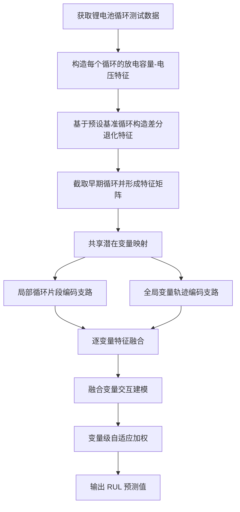
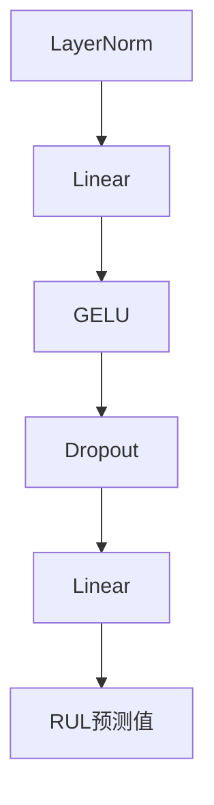
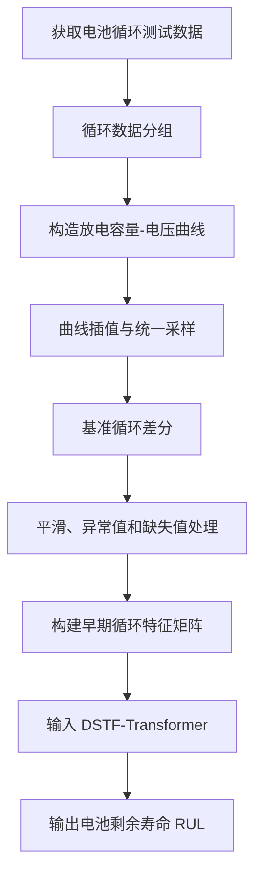
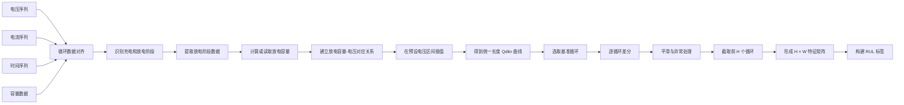
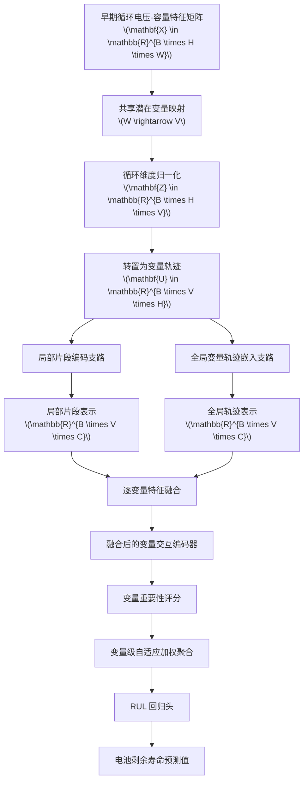
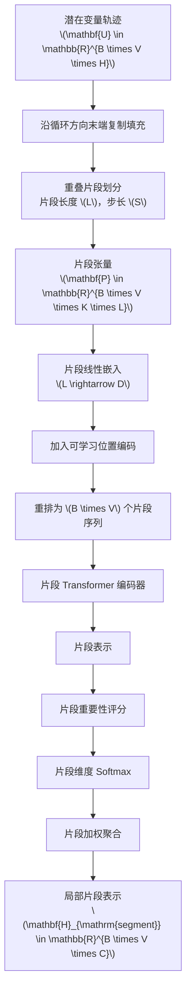
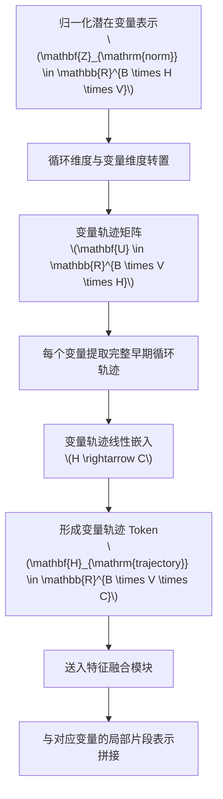
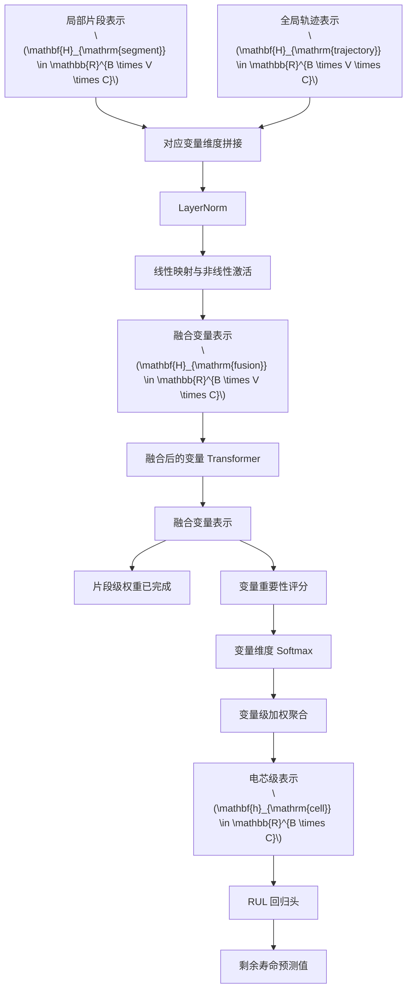

# 一、基本信息


**发明名称：**

一种基于DSTF-Transformer模型的锂电池剩余使用寿命RUL预测方法

**模型名称：**

双路径片段与轨迹融合变换器
Dual-Path Segment-Trajectory Fusion Transformer

**模型简称：**
DSTF-Transformer


# 二、技术领域

技术领域围绕以下内容展开：

本发明属于锂离子电池状态监测与寿命预测技术领域，具体涉及一种基于DSTF-Transformer模型的锂电池剩余使用寿命RUL预测方法。该方法涉及电池循环测试数据处理、早期循环退化特征提取、局部循环片段编码、全局变量轨迹建模以及深度学习回归预测。

# 三、背景技术


## 1. 局部退化模式与全局退化趋势的多尺度协同建模不足

电池早期循环数据同时包含局部循环片段内的容量变化、曲线突变和阶段性退化特征，以及整个早期循环窗口内的长期退化趋势。现有方法通常采用单一时间尺度进行特征提取，难以同时保留局部退化细节和全局变化趋势。

## 2. 电压-容量特征变量间的跨变量关联建模不足

电压-容量曲线包含多个特征维度，不同电压区域或潜在退化变量之间可能存在协同变化关系。现有方法通常主要沿循环时间维度提取特征，难以将不同变量的完整循环轨迹作为相互关联的特征单元进行建模。

## 3. 多层次退化特征的深度融合与自适应聚合不足

现有方法通常采用简单拼接、平均池化或预测结果加权等方式融合不同特征，难以在特征层面建立局部循环片段与全局变量轨迹之间的关联，也难以根据不同电芯的退化状态自适应识别关键片段和重要变量。

# 四、发明目的

发明目的围绕解决上述三个问题展开：

1. 提供一种能够同时提取局部循环退化模式和全局变量轨迹的锂电池RUL预测方法；
2. 建立不同潜在变量完整循环轨迹之间的跨变量关联；
3. 在特征层面融合局部片段信息和全局轨迹信息；
4. 根据输入电芯的退化状态自适应选择关键片段和重要变量；
5. 提高锂电池剩余使用寿命预测的准确性和稳定性。

# 五、技术方案总体概述




其中：

- 局部循环片段编码支路用于提取局部退化模式；
- 全局变量轨迹编码支路用于提取每个潜在变量在整个早期循环窗口内的变化轨迹；
- 两条支路在对应潜在变量维度进行中间特征融合；
- 融合后的变量通过Transformer建立跨变量关联；
- 最终通过变量级自适应加权得到电芯级表示并预测RUL。

# 六、数据获取与预处理方法


## 1. 数据来源

获取锂电池循环测试过程中的：

- 电压；
- 电流；
- 时间；
- 充电容量；
- 放电容量；
- 循环编号。


## 2. 放电容量-电压曲线构造

按照循环编号对原始测试数据进行分组，识别每个循环的放电阶段，构造该循环对应的放电容量-电压曲线。

对于每个循环，将原始曲线插值为统一长度的特征向量。在当前实施例中，每个循环的曲线长度统一为：

\[
W = 1000
\]

## 3. 基准循环差分

选取预设早期循环作为基准循环，将其他循环的放电容量-电压曲线与该基准曲线作差，得到退化差分特征。

当前实施例使用数组索引为 9 的循环作为基准循环：

\[
\mathbf{D}_{h}
=
\mathbf{Qdlin}_{h}
-
\mathbf{Qdlin}_{9}
\]

## 4. 早期循环窗口截取

从每个电芯中截取前 100 个循环：

\[
H = 100
\]

每个电芯形成特征矩阵：

\[
\mathbf{X}
\in
\mathbb{R}^{100 \times 1000}
\]

批量输入模型时，特征张量为：

\[
\mathbf{X}_{\mathrm{batch}}
\in
\mathbb{R}^{B \times 100 \times 1000}
\]

其中 \(B\) 表示批大小。

## 5. 特征平滑和异常值处理

对差分曲线进行平滑处理，并对异常值、缺失值、NaN和Inf进行处理。当前实现中，将无效特征值替换为零。

## 6. RUL 标签构造

以电池放电容量下降至标称容量的 80% 作为寿命终止条件：

\[
Q_{d}
\leq
0.8
\times
Q_{\mathrm{nominal}}
\]

根据电芯达到该条件时的循环编号构造 RUL 标签。

## 7. 数据集划分

当前具体实施例采用 MATR Primary 划分方式，按照电芯进行训练集和测试集划分，避免同一电芯的数据同时出现在训练集和测试集中。

后续交底书不需要展开 MATR Secondary、MATR CLO、CALCE 等多个实施例。它们可以作为后续补充实验，但不作为正文的主要技术路线。

# 七、DSTF-Transformer 模型结构


## 1. 共享潜在变量映射

输入特征矩阵：

\[
\mathbf{X}
\in
\mathbb{R}^{B \times 100 \times 1000}
\]

通过共享线性层将每个循环的 1000 维曲线特征映射为 64 个潜在变量：

\[
1000
\rightarrow
64
\]

得到：

\[
\mathbf{Z}
\in
\mathbb{R}^{B \times 100 \times 64}
\]

## 2. 循环维度归一化

对每个电芯、每个潜在变量沿循环维度进行归一化：

\[
Z_{\mathrm{norm},b,h,v}
=
\frac{
Z_{b,h,v}
-
\mu_{b,v}
}{
\max
\left(
\sigma_{b,v},
\varepsilon
\right)
}
\]

其中：

- \(\mu_{b,v}\) 为第 \(b\) 个电芯第 \(v\) 个潜在变量的循环均值；
- \(\sigma_{b,v}\) 为对应标准差；
- \(\varepsilon\) 为防止除零的最小值。

## 3. 局部循环片段编码支路

将潜在变量表示转置为：

\[
\mathbf{U}
\in
\mathbb{R}^{B \times 64 \times 100}
\]

其中每个潜在变量对应一条长度为 100 的早期循环轨迹。

采用：

```text
片段长度：16
片段步长：8
填充方式：末端复制填充
```

长度为 100 的循环轨迹经末端填充后得到长度 108 的轨迹，片段数量为：

\[
K
=
\left\lfloor
\frac{
108 - 16
}{
8
}
\right\rfloor
+
1
=
12
\]

因此片段张量为：

\[
\mathbf{P}
\in
\mathbb{R}^{B \times 64 \times 12 \times 16}
\]

每个片段经过线性嵌入：

\[
16
\rightarrow
64
\]

然后加入可学习位置编码，并通过两层片段 Transformer 编码器进行特征提取。

对于第 \(k\) 个片段，计算其重要性权重：

\[
\alpha_{b,v,k}
=
\operatorname{softmax}_{k}
\left(
s_{b,v,k}
\right)
\]

再进行片段加权聚合：

\[
\mathbf{h}_{\mathrm{segment},b,v}
=
\sum_{k=1}^{12}
\alpha_{b,v,k}
\mathbf{h}_{b,v,k}
\]

得到局部片段表示：

\[
\mathbf{H}_{\mathrm{segment}}
\in
\mathbb{R}^{B \times 64 \times 64}
\]

## 4. 全局变量轨迹编码支路

对每个潜在变量，保留其完整的 100 个早期循环轨迹：

\[
\mathbf{U}
\in
\mathbb{R}^{B \times 64 \times 100}
\]

通过线性层将每个变量的完整轨迹映射为 64 维变量表示：

\[
100
\rightarrow
64
\]

得到：

\[
\mathbf{H}_{\mathrm{trajectory}}
\in
\mathbb{R}^{B \times 64 \times 64}
\]

该表示反映每个潜在变量在整个早期循环窗口内的变化趋势。

## 5. 逐变量特征融合

对于相同潜在变量，将局部片段表示和全局变量轨迹表示进行拼接：

\[
\mathbf{H}_{\mathrm{cat}}
=
\operatorname{Concat}
\left(
\mathbf{H}_{\mathrm{segment}},
\mathbf{H}_{\mathrm{trajectory}}
\right)
\]

得到：

\[
\mathbf{H}_{\mathrm{cat}}
\in
\mathbb{R}^{B \times 64 \times 128}
\]

然后依次经过：

- LayerNorm；
- 线性层；
- GELU 激活；
- Dropout；

得到融合表示：

\[
\mathbf{H}_{\mathrm{fusion}}
\in
\mathbb{R}^{B \times 64 \times 64}
\]

## 6. 融合后的变量交互建模

将融合后的 64 个潜在变量输入两层变量级 Transformer：

\[
\mathbf{H}_{\mathrm{interaction}}
=
\operatorname{Transformer}_{\mathrm{variable}}
\left(
\mathbf{H}_{\mathrm{fusion}}
\right)
\]

得到：

\[
\mathbf{H}_{\mathrm{interaction}}
\in
\mathbb{R}^{B \times 64 \times 64}
\]

该模块用于建模不同潜在变量之间的关联关系。

## 7. 变量级自适应聚合

对每个潜在变量计算重要性分数：

\[
r_{b,v}
=
\operatorname{Linear}
\left(
\mathbf{H}_{\mathrm{interaction},b,v}
\right)
\]

通过变量维度上的 Softmax 得到权重：

\[
\beta_{b,v}
=
\operatorname{softmax}_{v}
\left(
r_{b,v}
\right)
\]

进行变量级加权聚合：

\[
\mathbf{h}_{\mathrm{cell},b}
=
\sum_{v=1}^{64}
\beta_{b,v}
\mathbf{H}_{\mathrm{interaction},b,v}
\]

得到电芯级表示：

\[
\mathbf{h}_{\mathrm{cell}}
\in
\mathbb{R}^{B \times 64}
\]

## 8. RUL回归输出

将电芯级表示输入多层感知机回归头：



最终输出：

\[
\widehat{\mathrm{RUL}}
\in
\mathbb{R}^{B}
\]

# 八、模型训练与推理

## 1. 模型训练

训练流程固定为：

1. 按电芯划分训练集和测试集；
2. 构造每个电芯的早期循环特征矩阵；
3. 构造 RUL 标签；
4. 对标签进行对数变换和 Z-score 标准化；
5. 将特征输入 DSTF-Transformer；
6. 计算预测值与标签之间的均方误差；
7. 使用 Adam 优化器更新模型参数。

均方误差为：

\[
\mathcal{L}
=
\frac{1}{B}
\sum_{b=1}^{B}
\left(
\widehat{\mathrm{RUL}}_{b}
-
\mathrm{RUL}_{b}
\right)^{2}
\]

当前实施例的主要训练参数为：

```text
训练轮数：1000
批大小：128
学习率：1e-3
局部片段 Transformer 层数：2
变量交互 Transformer 层数：2
隐藏维度：64
注意力头数：4
Dropout：0.1
```

## 2. 模型推理

对于待预测电芯：

1. 获取前 100 个循环的测试数据；
2. 按训练阶段相同的方法构造差分电压-容量特征；
3. 形成：

\[
\mathbf{X}
\in
\mathbb{R}^{100 \times 1000}
\]

4. 输入已训练的 DSTF-Transformer；
5. 得到 RUL 预测值；
6. 对预测结果执行标签逆变换；
7. 输出原始循环数尺度下的剩余使用寿命。


# 九、有益效果


1. 提高了局部退化模式与全局退化趋势的协同表征能力；
2. 加强了电压-容量潜在变量之间的关联建模；
3. 提高了多层次退化特征融合和关键片段、关键变量聚合的自适应能力。


# 十、附图

## 图 1：整体方法流程图



## 图 2：数据预处理流程图



## 图 3：DSTF-Transformer 总体结构图



## 图 4：局部循环片段编码支路



## 图 5：全局变量轨迹编码支路



## 图 6：逐变量融合与双重自适应加权

