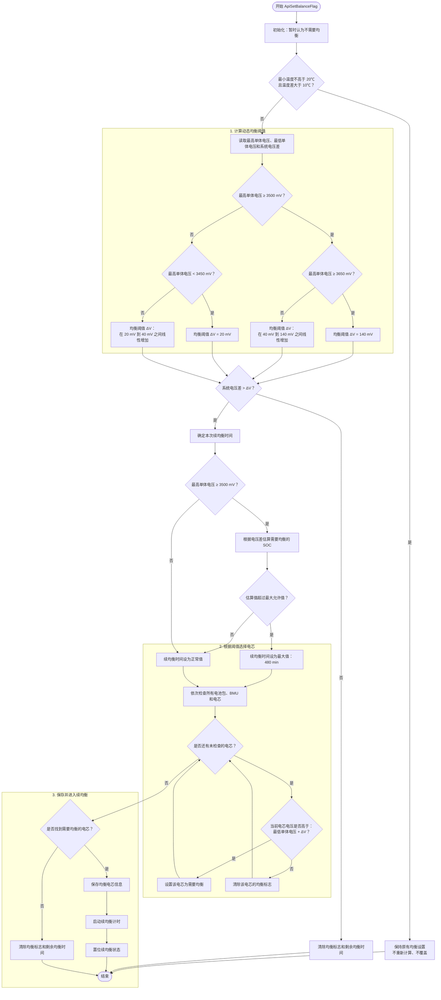

```mermaid
flowchart TD
    A([开始 ApiSetBalanceFlag]) --> B["初始化：暂时认为不需要均衡"]

    B --> C{"最小温度不高于 20℃<br/>且温度差大于 10℃？"}
    C -- 是 --> C1["保持原有均衡设置<br/>不重新计算、不覆盖"]
    C1 --> Z([结束])

    C -- 否 --> D["读取最高单体电压、最低单体电压和系统电压差"]

    subgraph T["1. 计算动态均衡阈值"]
        D --> E{"最高单体电压 ≥ 3500 mV？"}

        E -- 是 --> F{"最高单体电压 ≥ 3650 mV？"}
        F -- 是 --> G["均衡阈值 ΔV = 140 mV"]
        F -- 否 --> H["均衡阈值 ΔV：<br/>在 40 mV 到 140 mV 之间线性增加"]

        E -- 否 --> I{"最高单体电压 < 3450 mV？"}
        I -- 是 --> J["均衡阈值 ΔV = 20 mV"]
        I -- 否 --> K["均衡阈值 ΔV：<br/>在 20 mV 到 40 mV 之间线性增加"]
    end

    G --> L{"系统电压差 > ΔV？"}
    H --> L
    J --> L
    K --> L

    L -- 否 --> L1["清除均衡标志和剩余均衡时间"]
    L1 --> Z

    L -- 是 --> M["确定本次续均衡时间"]
    M --> M1{"最高单体电压 ≥ 3500 mV？"}

    M1 -- 是 --> M2["根据电压差估算需要均衡的 SOC"]
    M2 --> M3{"估算值超过最大允许值？"}
    M3 -- 是 --> M4["续均衡时间设为最大值：480 min"]
    M3 -- 否 --> M5["续均衡时间设为正常值"]

    M1 -- 否 --> M5

    subgraph S["2. 根据阈值选择电芯"]
        M4 --> N["依次检查所有电池包、BMU 和电芯"]
        M5 --> N

        N --> O{"是否还有未检查的电芯？"}
        O -- 是 --> P{"当前电芯电压是否高于：<br/>最低单体电压 + ΔV？"}

        P -- 是 --> Q["设置该电芯为需要均衡"]
        P -- 否 --> R["清除该电芯的均衡标志"]

        Q --> O
        R --> O
    end

    O -- 否 --> U{"是否找到需要均衡的电芯？"}

    subgraph V["3. 保存并进入续均衡"]
        U -- 是 --> W["保存均衡电芯信息"]
        W --> X["启动续均衡计时"]
        X --> Y["置位续均衡状态"]
        Y --> Z

        U -- 否 --> U1["清除均衡标志和剩余均衡时间"]
        U1 --> Z
    end
```